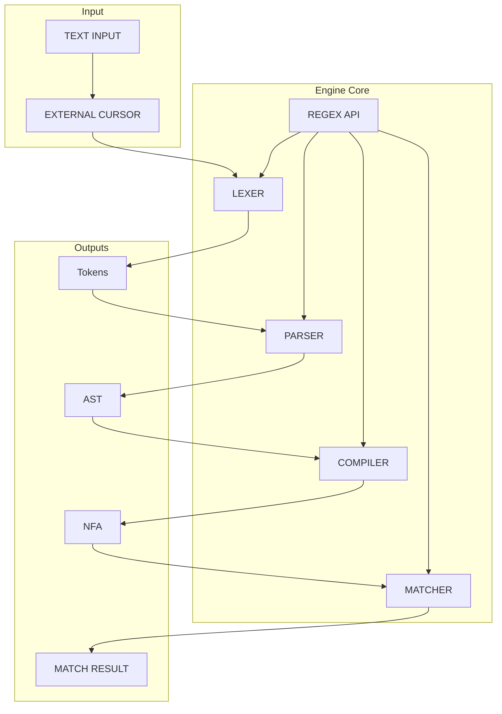

# Motoko Regex Engine

A NFA based regular expression engine implemented in Motoko.

⚠️ **Note**: This project is newly released! There may still be undiscovered issues. Users are encouraged to report any bugs or provide feedback to help improve the engine.

## Installation

You can install the regex engine using [MOPS](https://mops.one/):

```bash
mops add regex
```

## Import

```motoko
import Regex "mo:regex";
```

## Usage Example


## Documentation

For full documentation, visit [Motoko Regex Engine Docs](https://demali-876.github.io/motoko_regex_engine/introduction.html).

## Architecture

The following diagram illustrates the core components and data flow of the regex engine:



### Component Description

1. **Input Processing**:
   - Text Input: Raw regular expression string
   - External Cursor: Character-by-character stream processor

2. **Core Components**:
   - **Lexer**: Tokenizes the input stream into meaningful regex components
   - **Parser**: Builds an Abstract Syntax Tree (AST) from tokens
   - **Compiler**: Transforms the AST into a Non-deterministic Finite Automaton (NFA)
   - **Matcher**: Executes pattern matching using the compiled NFA

3. **Intermediate Outputs**:
   - Tokens: Lexical units of the regex pattern
   - AST: Tree representation of the pattern structure
   - NFA: State machine for pattern matching
   - Match Result: Final output indicating match success/failure and captures

## Support & Acknowledgements

This project was developed with the support of a developer grant from the DFINITY Foundation.

### Community Feedback

Your feedback is invaluable in improving this and future projects. Feel free to share your thoughts and suggestions through issues or discussions.

### Support the Developer

If you find this project valuable and would like to support my work on this and other open-source initiatives, you can send ICP donations to:

```motoko
8c4ebbad19bf519e1906578f820ca4f6732ceecc1d5396e5a5713046dca251c1
```

